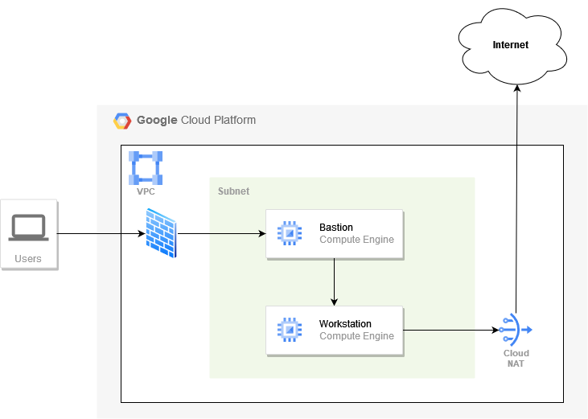

# Basic Network

- Create VPC network with a single /24 subnet;
- Communication with GCP services must not go over public Internet;
- Create bastion host and restrict access to it to a well-known IP addresses only;
- All compute instances except bastion host must not have public IP address;
- All compute instances should be able to communicate with public Internet;

## Acceptance criteria

- You can login to bastion host only from allowed locations (use VPN to check).
- All hosts should be able to reach public Internet (run `sudo apt-get update` to check).
- Requests to Google Cloud APis on `Workstation` instance should not go over the public Internet (use `traceroute storage.googleapis.com` to check).