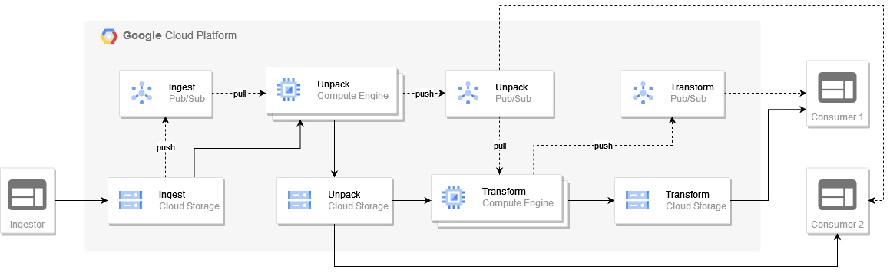

# Bulk Processing



**Ingest**
- External data producers are uploading compressed data into `ingest` storage bucket;
- Object creation in `ingest` bucket is triggering pubsub message to `ingest` topic;

**Unpack**
- `Unpack` managed group of instances is pulling new messages from `ingest` subscription, downloading compressed data from `ingest` bucket, unpack data and write uncompressed data to `unpack` storage bucket;
- New message with path to unpacked data is sent to `unpack` topic;
- `Unpack` managed instance group autoscaling based on number unprocessed messages in `ingest` subscription;

**Transform**
- `Transform` managed group of instances is pulling new messages from `unpack` subscription, downloading data from `unpack` storage bucket, apply data transformation and write transformed data to `transform` storage bucket;
- New message with path to transformed data is sent to `transform` topic;
- `Transform` managed instance group autoscaling based on number of unprocessed messages in `unpack` subscription;

## Ingest

- [ingest.sh](bulk-processing/ingest.sh)
- [generator.py](bulk-processing/generator.py)

Example:

```
./ingest.sh gs://ingest-bucket-name
```

## Unpack

- [unpack.py](bulk-processing/unpack.py)
- [requirements.txt](bulk-processing/requirements.txt)

## Transform

- [transform.py](bulk-processing/transform.py)
- [requirements.txt](bulk-processing/requirements.txt)

## Hints

To generate massive ingestion you can use `parallel` from `moreutils`.

Example:

```
parallel -j 50 bash -c "./ingest.sh gs://ingest-bucket-name" -- $(seq 1 1000 | xargs echo)
```

## Acceptance criteria

- Data ingestion will trigger data unpack and transformation (check content of `unpack` and `transform` buckets);
- Managed groups auto scaling is based on number of unprocessed messages in appropriate Pub/Sub subscription;
