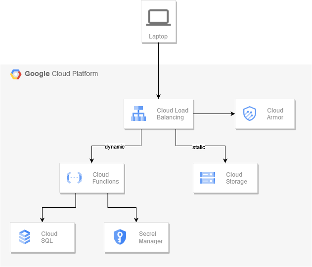

# Dynamic Serverless Website



- Dynamic requests are served by Cloud Function;
- Static content is served by Cloud Storage Bucket;
- Cloud function connects to Cloud SQL instance using private IP address;
- Cloud SQL credentials are stored in Secret Manager;
- Only well-known IP addresses are served by load balancer;

## Cloud function

- [main.py](dynamic-serverless-website/main.py)
- [requirements.txt](dynamic-serverless-website/requirements.txt)

## Storage bucket

- [index.html](dynamic-serverless-website/index.html)
- [404.html](dynamic-serverless-website/404.html)

## Hints

Secret contents

```
{
  "host": "<db address>",
  "username": "<db username>",
  "password": "<db password>"
}
```

Cloud function secret reference - `DB_CREDS` environment variable.

Load balancer routing

- `/*` -> Cloud storage bucket
- `/api/*` -> Cloud function

## Acceptance criteria

- Database time is printed when opening `http://<LB IP>/` in browser.
- `Page not found` error should be displayed for `http://<LB IP>/nonexistant`.
- SQL database has only private IP address.
- Database credentials are stored in Secret Manager.
- Access to `http://<LB IP>/` or `http://<LB IP>/api/` should be denied for unknown locations (enable VPN to check).