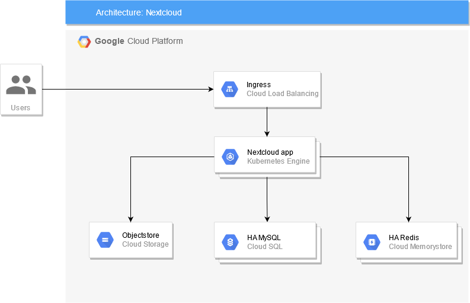
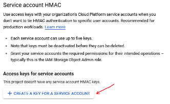
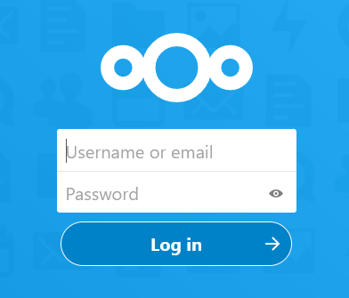
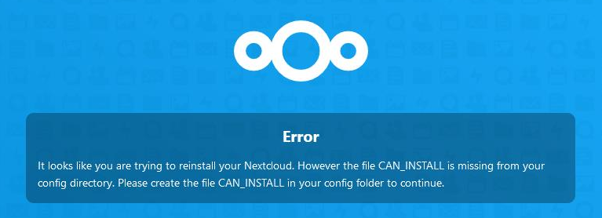

# Final task

## Architecture diagram



- **Resolution Notes:**
  - Project ID: `gcp-devops-final-task-africa-africa`
  - Region: `us-central1`
  - Zones: `us-central1-a`, `us-central1-b`

## Tasks

1. **Create VPC with custom subnet**
    - Network name: `network`
    - Subnet name: `us-central1-subnet`
    - Region: `us-central1`
    - Subnet primary IP range: `10.1.0.0/24`
    - Subnet secondary ranges:
        - GKE pods secondary range:
            - name `pods`
            - IP range `10.2.0.0/20`
        - GKE services secondary range:
            - name `services`
            - IP range `10.3.0.0/20`
    - Private Google Access: `On`

    - **Resolution Notes:**
        - Enabled Compute Engine API

2. **Allocate IP range for private services connections**
    - Name: `private-services`
    - Range: `10.4.0.0/20`

    - **Resolution Notes:**
        - Enabled Service Network API

3. **Create NAT gateway for internet access**
    - Name: `nat-gateway`
    - VPC network: `network`
    - Region: `us-central1`
    - Create new Cloud Router
    - NAT mapping:
        - Source: primary and secondary ranges for all subnets
        - NAT IP address: automatic

    - **Resolution Notes:**
        - Cloud Router was named `nat-router`

4. **Create GKE service account**
    - Name: `kubernetes`
    - Roles:
        - Artifact Registry Reader
        - Logs Writer
        - Monitoring Metric Writer
        - Monitoring Viewer
        - Stackdriver Resource Metadata Writer
        - Storage Object Viewer

    - **Resolution Notes:**
        - Email: `kubernetes@gcp-devops-final-task-africa.iam.gserviceaccount.com`

5. **Create Nextcloud service account**
    - Name: `nextcloud`
    - Roles:
        - Storage Object Admin

    - **Resolution Notes:**
        - Email: `nextcloud@gcp-devops-final-task-africa.iam.gserviceaccount.com`

6. **Create standard GKE cluster with private nodes and public control plane**
    - Name: `cluster`
    - Region: `us-central1`
    - Zones: `us-central1-a`, `us-central1-b`
    - Total number of nodes: 2
    - Node type: `n1-standard-1`
    - Service account: `kubernetes`
    - Control plane IP range: `172.16.0.0/28`
    - Use existing secondary ranges for pods and services
    - Authorize your IP address for control plane access

    - **Resolution Notes:**
        - Enabled Kubernetes Engine API
        - Create VPC Network
            - Name: `network-control-plane`
            - Subnet
                - Name: `us-central1-subnet-control-plane`
                - Region: `use-central-1`
                - Range: `172.16.0.0/28`
                - Private Google Access: `On`
        - Create a VPC Peering
            - Name: `network-peering`
            - Your VPC network: `network-peering`
            - Peered VPC network: `network-control-plane`
        - Create the Cluster itself
            - Create a Fleet Registration
                - Name: `gcp-final-task-nextcloud-fleet`
            - In the Node Pools
                - `default-pool` under User-managed node pool details, Number of nodes (per zone) was set to `1`
                    - `nodes` were set as above with disk usage to 30G to fit in the Free Trial
                    - **Network tag `gke-cluster-node`**
            - Created a Network
                - Added authorized Networks
                    - Name: `Network Control Plane`
                    - Network: `172.16.0.0/28`
                    - and
                    - Name: `Local Network`
                    - Network: `85.48.191.106/32`
                    - and
                    - Name `GCP Shell`
                    - Network: `35.233.110.196/32`

7. **Create highly available Cloud SQL MySQL instance with private connectivity**
    - Name: `database`
    - Set a strong root password
    - MySQL version: `8.0.x`
    - Region: `us-central1`
    - Zones: `us-central1-a`, `us-central1-b`
    - Type: Standard 1 vCPU, 3.75 GB
    - Storage:
        - Type: SSD
        - Size: 10 GB
        - Enable automatic storage increases
    - Connections:
        - Set up private IP connection
    - Backup:
        - Location: US
        - Enable automatic backups (1:00 AM–5:00 AM)
        - Automatic backup retention: 30 days
        - Point-in-time recovery: 7 days
    - Maintenance:
        - Execute maintenance on Sunday (12:00 AM–1:00 AM)

    - **Resolution Notes:**
        - Allocated IP Range
            - Name: `network-ip-range`
            - Range: `10.14.32.0/20`
        - New endpoint
            - Service Class: `google-cloud-sql`
            - Policy Name: `google-cloud-sql-us-central1-network-policy`
            - Project: `gcp-final-task-nextcloud`
            - Network: `network`
            - Region: `us-central1`
            - Subnet: `us-central1-subnet`
        - Public IP
            - Address: `34.172.111.223`

8. **Create database and user for application**
    - Database:
        - Name: `nextcloud`
        - Character set: `utf8mb4`
        - Collation: `utf8mb4_general_ci`
    - User:
        - Name: `nextcloud`
        - Set password for user
        - Allow connections from any host

    - **Resolution Notes:**
        - Created the user first then logged into `mysql` database
        - Created database with cloud SQL Studio

            ```SQL
            CREATE DATABASE `nextcloud` CHARACTER SET utf8mb4 COLLATE utf8mb4_general_ci;
            ```

9. **Create Memorystore Redis instance**
    - Name: `redis`
    - Enable high availability
    - Region: `us-central1`
    - Version: `5.0`
    - Capacity: 1 GB

    - **Resolution Notes:**
        - Create a Valkey instance
            - Configured a Private Service Connectivity (PSC)
                - Policy Name: `redis-service-connection-policy`
                - Subnet: `us-central1-subnet`
            - Added memory snapshot
                - Frequency: `Every 1 hour`
                - Start Time: `05:00 AM`

10. **Create Cloud Storage bucket**
    - Name: `<project>-nextcloud-external-data` (replace `<project>` with your project ID)
    - Location: `us-central1`
    - Enable fine-grained access control

    - **Resolution Notes:**
        - Bucket Name: `gcp-final-task-nextcloud-external-data`

11. **Create HMAC key and secret for Nextcloud service account to use with Google Cloud Storage interoperability**
    1. Go to the [Google Cloud Platform console](https://console.cloud.google.com/).

    2. Navigate to **Cloud Storage → Settings** or open the [Storage settings](https://console.cloud.google.com/storage/settings) page.

    3. Go to the **INTEROPERABILITY** tab.

    4. In **Service account HMAC** under **Access keys for service accounts**, click **CREATE A KEY FOR SERVICE ACCOUNT**.

        

    5. Choose the service account `nextcloud@<project>.iam.gserviceaccount.com` and click **CREATE KEY**.

    6. Write down the **Access key** and **Secret** values (you won’t be able to get the secret value later).

    7. Click **CLOSE**.

    - **Resolution Notes:**
      - No additional notes here.

12. **Build Nextcloud Docker image and push to Google Cloud Registry**
    - See the original task README for more details: [https://github.com/tataranovich/cloudx-l2-final-task/blob/master/README.md](https://github.com/tataranovich/cloudx-l2-final-task/blob/master/README.md).

    1. Open Google Cloud Shell.

    2. Clone the repository `https://github.com/tataranovich/cloudx-l2-final-task.git`.

    3. Build the Docker image from `cloudx-l2-final-task/nextcloud-docker/`.

    4. Push the Docker image to Google Cloud Registry (or Artifact Registry).

    - **Resolution Notes:**
      - Update HMAC Key and Secret to `values.yaml`
      - Update redis server
        - host as `redis`
      - Update MySQL 
        - host Internal IP `10.14.32.2`
        - port `3306`

13. **Deploy nginx-ingress chart from Bitnami**
    - Chart repo: [https://charts.bitnami.com/bitnami](https://charts.bitnami.com/bitnami).
    - See [https://github.com/tataranovich/cloudx-l2-final-task/blob/master/README.md](https://github.com/tataranovich/cloudx-l2-final-task/blob/master/README.md) for details.
    - Example commands:

         ```bash
         helm repo add bitnami https://charts.bitnami.com/bitnami
         helm install nginx-ingress bitnami/nginx-ingress-controller
         ```

14. **Create Kubernetes secrets for admin and MySQL credentials**
    - Follow instructions in [https://github.com/tataranovich/cloudx-l2-final-task/blob/master/README.md](https://github.com/tataranovich/cloudx-l2-final-task/blob/master/README.md)

15. **Deploy Nextcloud Helm chart**
    - Chart repo: [https://nextcloud.github.io/helm/](https://nextcloud.github.io/helm/).
    - See [https://github.com/tataranovich/cloudx-l2-final-task/blob/master/README.md](https://github.com/tataranovich/cloudx-l2-final-task/blob/master/README.md) for details.

     1. Copy `cloudx-l2-final-task/values.example.yaml` to `values.yaml`.
     2. Update `values.yaml` with the proper image repository and tag, storage bucket name, HMAC key and secret, Redis host, and MySQL host.
     3. Deploy the Nextcloud Helm chart using `values.yaml`.

16. **Add ingress load balancer IP address to your hosts file**
    - Example entry:

        ```text
        1.2.3.4 nextcloud.kube.home
        ```

    - **Resolution Notes:**
      - Add to `/etc/hosts`
        - `34.9.243.133 nextcloud.kube.home`
      - Add to firewall
        - `sudo ufw allow from 34.9.243.133`
      - Fix the images paths for `nextcloud` and `nginx`
      - Add manifest file `nextcloud-ingress.yaml` for `nginx`

17. **Log in to Nextcloud**
    - Open [http://nextcloud.kube.home/login](http://nextcloud.kube.home/login).
    - Username: `admin`
    - Password: `admin123`
    - Use a different username/password if you used other values when creating the `nextcloud-admin` secret.

18. **Upload files to Nextcloud**
    1. Check the initial number of objects in the bucket `<project>-nextcloud-external-data`.

    2. Upload a few files to Nextcloud.

    3. Ensure that the number of objects in the `<project>-nextcloud-external-data` bucket increased.

**Acceptance criteria:**

1. Running Nextcloud instance (see “Login screen” in screenshots)
2. Able to login to Nextcloud using admin credentials
3. Able to upload files to Nextcloud

## Screenshots

### Login screen

Log in with the admin credentials that were created during step 14 (for example: `admin` / `admin123`).



### Failed installation

If you see this error message then the Nextcloud installation is not correct. Uninstall the application and recreate the database before retrying.


