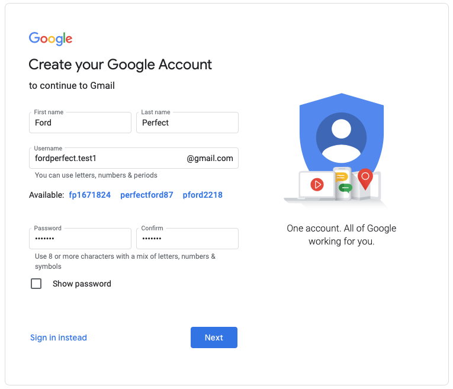
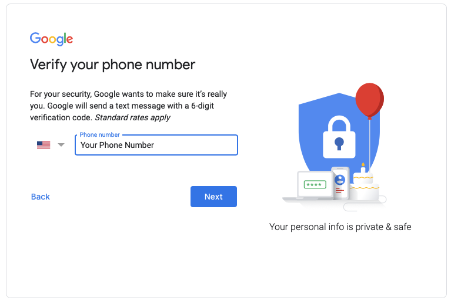
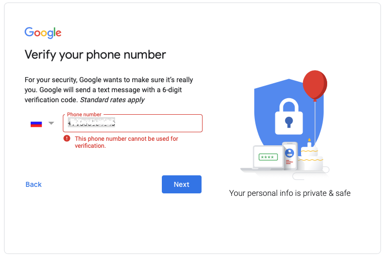
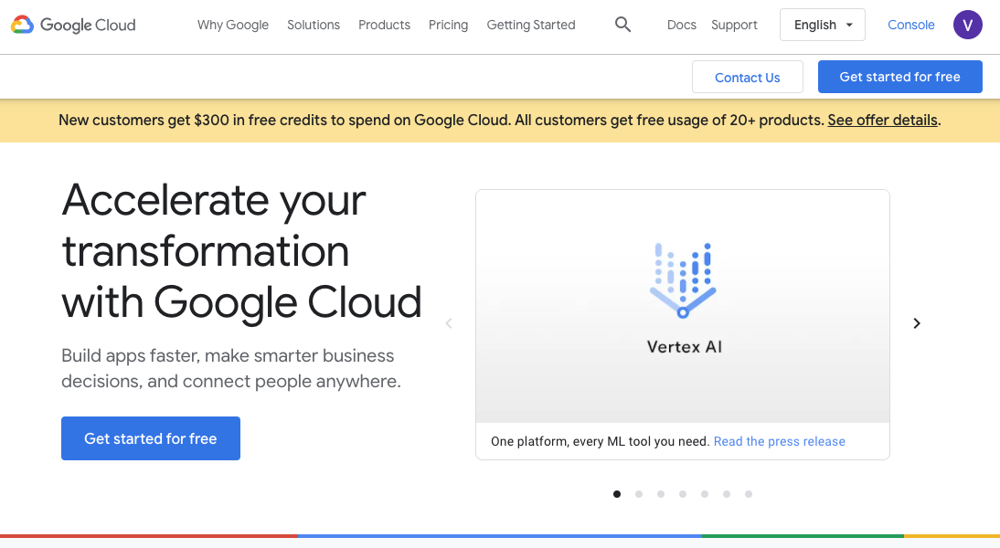
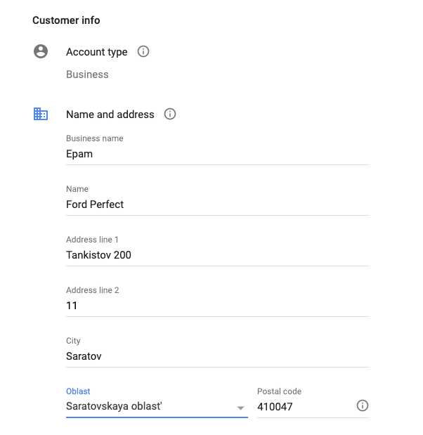
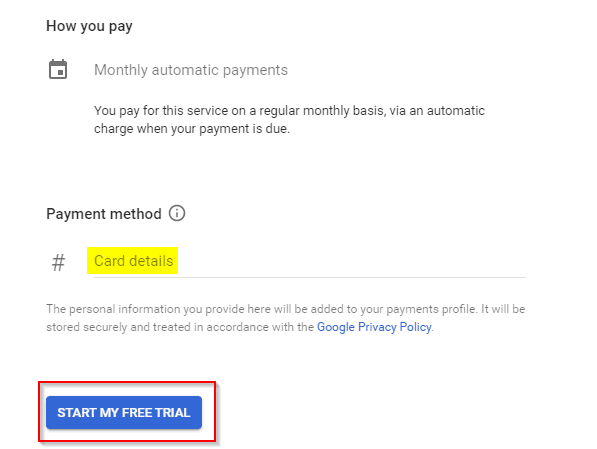

# How to create a Google Cloud free account

## Pre-requisites

- You should have a credit card and a phone number.

## Create temporary Gmail account

Please create temporary Gmail account which will be used for final task.
After final task will be completed, please delete this temporary
account.

Verify your phone number

If you will get the following error message, please use different phone
number

## Navigate to the <https://cloud.google.com/> and press **Get started for free**

## Choose your country and accept Terms of Service

You need to be logged in into your Google Gmail account.

## Fill up your credit card and personal details

Enter your personal details: name, address, city, postal code, state,
and phone number.

Account Type: Specify the account type either Individual or Business

Next provide your card details and click **Start my free trial**

