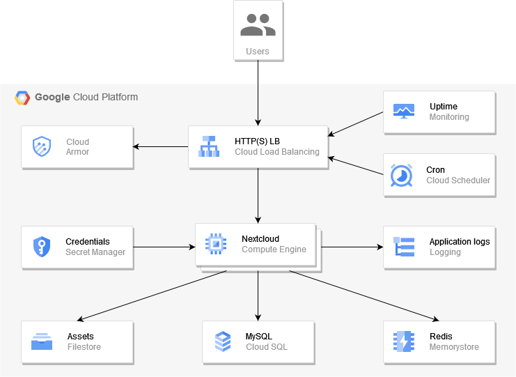

# Nextcloud GCE



- Filestore is used as user files storage;
- Cloud SQL MySQL is used as relational database;
- Memorystore Redis is used as cache storage;
- Secret Manager is used as secure credentials storage;
- Cloud Scheduler is used to run Nextcloud cron job;
- Global HTTP(S) Load Balancer is used to expose application to the Internet;
- Cloud Armor is used to protect application from unauthorized access;
- Cloud Logging is used as Nextcloud application logs storage;
- Cloud Monitoring is used to implement application uptime checks;

## Hints

<details>
<summary>Secret contents example</summary>

```
{
    "nextcloud": {
        "username": "${nextcloud_username}",
        "password": "${nextcloud_password}",
        "fqdn": "${nextcloud_fqdn}"
    },
    "mysql": {
        "connection": "${mysql_connection}",
        "username": "${mysql_username}",
        "password": "${mysql_password}"
    },
    "redis": {
        "host": "${redis_host}",
        "port": ${redis_port},
        "auth": "${redis_auth}"
    },
    "nfs": {
        "host": "${nfs_host}",
    "share": "${nfs_share}"
    }
}
```
</details>

<details>
<summary>Startup script example</summary>

```
#!/bin/bash -xe
apt-get update
apt-get install -y apache2 libapache2-mod-php7.4 php-imagick php-redis php7.4-bcmath php7.4-curl php7.4-gd php7.4-gmp php7.4-intl php7.4-mbstring php7.4-mysql php7.4-xml php7.4-zip mariadb-client curl nfs-common jq libmagickcore-6.q16-6-extra

SECRET_ID=$(curl -fsSLH 'Metadata-Flavor:Google' http://169.254.169.254/computeMetadata/v1/instance/attributes/secret-id)
SECRET_VERSION=$(curl -fsSLH 'Metadata-Flavor:Google' http://169.254.169.254/computeMetadata/v1/instance/attributes/secret-version)
NEXTCLOUD_SECRET=$(gcloud secrets versions access ${SECRET_VERSION} --secret=${SECRET_ID})
MYSQL_CONNECTION=$(echo $NEXTCLOUD_SECRET | jq -r .mysql.connection)
MYSQL_USERNAME=$(echo $NEXTCLOUD_SECRET | jq -r .mysql.username)
MYSQL_PASSWORD=$(echo $NEXTCLOUD_SECRET | jq -r .mysql.password)
NEXTCLOUD_USERNAME=$(echo $NEXTCLOUD_SECRET | jq -r .nextcloud.username)
NEXTCLOUD_PASSWORD=$(echo $NEXTCLOUD_SECRET | jq -r .nextcloud.password)
NEXTCLOUD_FQDN=$(echo $NEXTCLOUD_SECRET | jq -r .nextcloud.fqdn)
REDIS_HOST=$(echo $NEXTCLOUD_SECRET | jq -r .redis.host)
REDIS_PORT=$(echo $NEXTCLOUD_SECRET | jq -r .redis.port)
REDIS_AUTH=$(echo $NEXTCLOUD_SECRET | jq -r .redis.auth)
NFS_HOST=$(echo $NEXTCLOUD_SECRET | jq -r .nfs.host)
NFS_SHARE=$(echo $NEXTCLOUD_SECRET | jq -r .nfs.share)

curl -fsSLo /usr/local/bin/cloudsqlproxy https://dl.google.com/cloudsql/cloud_sql_proxy.linux.amd64
chmod +x /usr/local/bin/cloudsqlproxy
useradd -d /var/run/cloudsqlproxy -s /usr/sbin/nologin -r cloudsqlproxy
mkdir /var/run/cloudsqlproxy
chown cloudsqlproxy:cloudsqlproxy /var/run/cloudsqlproxy

cat <<_EOF_ | tee /etc/systemd/system/cloudsqlproxy.service
[Install]
WantedBy=multi-user.target

[Unit]
Description=Google Cloud Compute Engine SQL Proxy
Requires=networking.service
After=networking.service

[Service]
Type=simple
WorkingDirectory=/usr/local/bin
ExecStart=/usr/local/bin/cloudsqlproxy -quiet -dir=/var/run/cloudsqlproxy -instances=${MYSQL_CONNECTION}=tcp:3306
Restart=always
StandardOutput=journal
User=cloudsqlproxy
_EOF_

systemctl daemon-reload
systemctl enable cloudsqlproxy.service
systemctl start cloudsqlproxy.service

mkdir -p /var/nextcloud/{data,webroot}
mount -t nfs ${NFS_HOST}:${NFS_SHARE} /var/nextcloud/data
mkdir -p /var/nextcloud/data/config
touch /var/nextcloud/data/config/config.php
chown www-data:www-data /var/nextcloud/data /var/nextcloud/data/config /var/nextcloud/data/config/config.php

if [ ! -d /var/nextcloud/webroot/config ]; then
	curl -fsSLo /tmp/nextcloud-23.0.5.tar.bz2 https://download.nextcloud.com/server/releases/nextcloud-23.0.5.tar.bz2
	tar -xjf /tmp/nextcloud-23.0.5.tar.bz2 -C /var/nextcloud/webroot --strip-components=1
	chown -R www-data:www-data /var/nextcloud/webroot
    rm -fv /var/nextcloud/webroot/config/{config.php,CAN_INSTALL}
    ln -sfT /var/nextcloud/data/config/config.php /var/nextcloud/webroot/config/config.php
fi

cat <<_EOF_ | sudo tee /etc/apache2/sites-available/000-default.conf
<VirtualHost *:80>
    ServerAdmin webmaster@localhost
    DocumentRoot /var/nextcloud/webroot

    <IfModule mod_headers.c>
        Header always set Strict-Transport-Security "max-age=15552000; includeSubDomains"
    </IfModule>

    <Directory /var/nextcloud/webroot>
        Options +FollowSymLinks
        AllowOverride All
        Require all granted

        <IfModule mod_dav.c>
            Dav Off
        </IfModule>
    </Directory>
</VirtualHost>
_EOF_
a2enmod rewrite
a2enmod headers

cat <<_EOF_ | tee -a /etc/php/7.4/apache2/php.ini
memory_limit = 512M
redis.session.locking_enabled=1
redis.session.lock_retries=-1
redis.session.lock_wait_time=10000
session.save_handler = redis
session.save_path = "tcp://${REDIS_HOST}:${REDIS_PORT}?auth=${REDIS_AUTH}"
_EOF_

cat <<_EOF_ | tee -a /etc/php/7.4/cli/php.ini
memory_limit = -1
redis.session.locking_enabled=1
redis.session.lock_retries=-1
redis.session.lock_wait_time=10000
session.save_handler = redis
session.save_path = "tcp://${REDIS_HOST}:${REDIS_PORT}?auth=${REDIS_AUTH}"
_EOF_

systemctl restart apache2.service

mkdir /var/log/nextcloud
chown root:www-data /var/log/nextcloud
chmod 775 /var/log/nextcloud

cd /tmp
curl -sSO https://dl.google.com/cloudagents/add-google-cloud-ops-agent-repo.sh
chmod +x add-google-cloud-ops-agent-repo.sh
./add-google-cloud-ops-agent-repo.sh --also-install
cat <<_EOF_ | tee /etc/google-cloud-ops-agent/config.yaml 
logging:
  receivers:
    nextcloud:
      type: files
      include_paths:
      - /var/log/nextcloud/nextcloud.log
  processors:
    nextcloud:
      type: parse_json
      time_key: time
      time_format: %Y-%m-%dT%H:%M:%S%z
    nextcloud_severity:
      type: modify_fields
      fields:
        severity:
          copy_from: jsonPayload.level
          default_value: DEFAULT
          map_values:
            "0": DEBUG
            "1": INFO
            "2": WARNING
            "3": ERROR
            "4": EMERGENCY
  service:
    pipelines:
      default_pipeline:
        receivers: []
        processors: []
      nextcloud:
        receivers: [nextcloud]
        processors: [nextcloud, nextcloud_severity]
_EOF_
systemctl restart google-cloud-ops-agent

cd /var/nextcloud/webroot
if ! sudo -u www-data php occ status | grep -q 'installed: true$'; then
    sudo -u www-data php occ maintenance:install --database=mysql --database-name=nextcloud --database-host=127.0.0.1 --database-port=3306 --database-user=${MYSQL_USERNAME} --database-pass=${MYSQL_PASSWORD} --admin-user=${NEXTCLOUD_USERNAME} --admin-pass=${NEXTCLOUD_PASSWORD} --data-dir=/var/nextcloud/data --no-interaction
    sudo -u www-data php occ config:system:set trusted_domains 1 --value="${NEXTCLOUD_FQDN}"
    sudo -u www-data php occ config:system:set logdateformat --value="Y-m-d\TH:i:sO"
    sudo -u www-data php occ config:system:set logfile --value=/var/log/nextcloud/nextcloud.log
    sudo -u www-data php occ config:system:set redis host --value="${REDIS_HOST}"
    sudo -u www-data php occ config:system:set redis port --value="${REDIS_PORT}"
    sudo -u www-data php occ config:system:set redis password --value="${REDIS_AUTH}"
    sudo -u www-data php occ config:system:set memcache.local --value='\OC\Memcache\Redis'
    sudo -u www-data php occ config:system:set memcache.distributed --value='\OC\Memcache\Redis'
    sudo -u www-data php occ config:system:set memcache.locking --value='\OC\Memcache\Redis'
    sudo -u www-data php occ config:system:set filelocking.enabled --value=true
fi

echo FINISHED
```
</details>

## Acceptance criteria

- You can login to the Nextcloud using admin credentials from well-known locations;
- You can upload new files;
- Cron job is running every 5 minutes (check `Settings` / `Basic Settings` / `Background jobs` / `Last job ran seconds ago`);
- Application is protected from unauthorized access from unknown locations (use VPN to check);
- You receive monitoring alert if application goes down (stop database to check);
- Database communications over network are encrypted (check with `tcpdump` that traffic between GCE instances and Cloud SQL instance is encrypted);
- High availability during single zone failure (delete single instance to check);